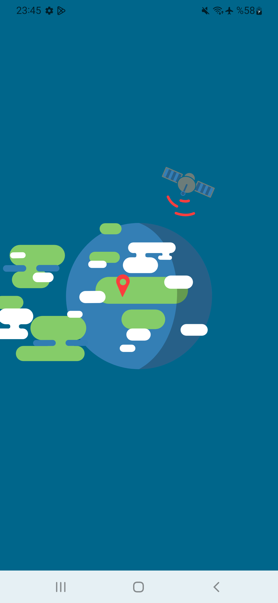
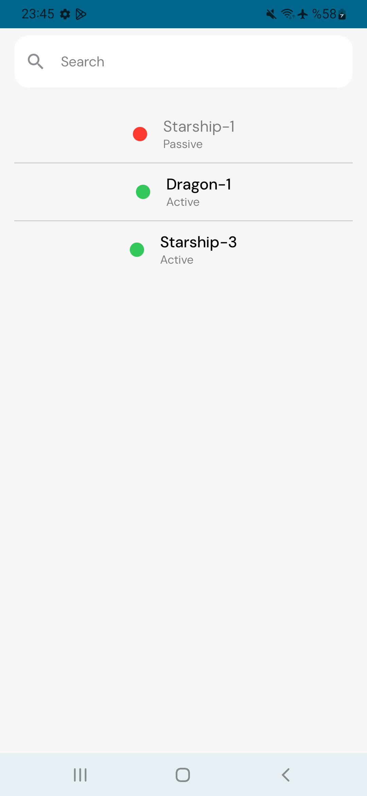
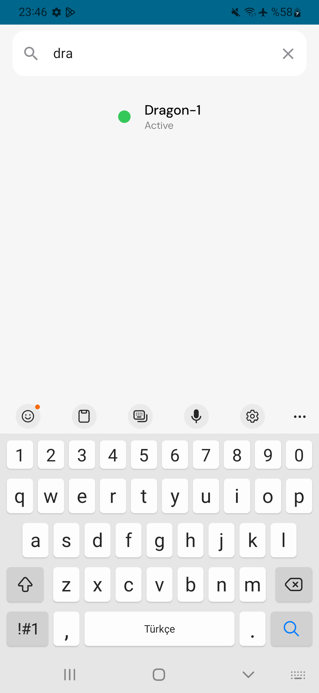
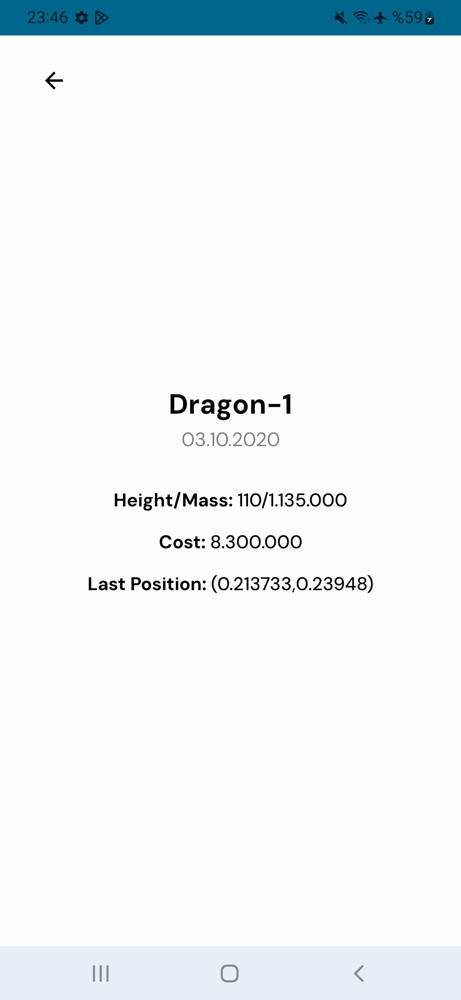

# Multi Module Uydu Uygulaması

Bu proje, modern Android geliştirme tekniklerini kullanarak oluşturulmuş çok modüllü bir uydu takip uygulamasıdır.

## Ekran Görüntüleri


<p align="center">
  
  
  
  
</p>

## Proje Özellikleri

- **MVVM ile Clean Architecture**: Sürdürülebilir ve test edilebilir kod yapısı
- **Coroutines & Flow**: Asenkron işlemler ve reaktif programlama
- **Navigation**: Birden fazla NavGraph
- **Hilt for Dependency Injection**: Bağımlılıkların yönetimi
- **Retrofit**: RESTful API istekleri
- **DataStore**: Json verileri kaydetme

## Özellikler

- Uydu alıcılarını görüntüle
- Search işlemi ile filtrele
- Modern ve kullanıcı dostu arayüz (Material 3 tasarım)
- Çok modüllü mimari yapısı

## Proje Yapısı

Proje aşağıdaki ana modüllerden oluşmaktadır:

- **app:** Ana uygulama modülü - navigasyon ve genel uygulama bileşenlerini içerir
- **feature:** Özellik modüllerini içeren ana klasör
    - **home:** Ana ekran özelliği
         -data
         -domain
         -presentation
    - **detail:** Ana ekran özelliği
- **core:**
   -**common:**
   -**network:**
   -**resources:**
   -**uikit:**
- **navigation:**  

Her modül Clean Architecture prensipleri uygulanarak yapılandırılmıştır:
- **presentation:** UI bileşenleri, ViewModeller
- **domain:** Kullanım durumları, modeller ve repository arayüzleri
- **data:** Repository implementasyonları, veri kaynakları ve DTO'lar

## Kurulum ve Çalıştırma

1. Projeyi klonlayın:
```
git clone https://github.com/sezginozgurr/MultiModuleSatellite.git
```

2. Android Studio'da projeyi açın ve Gradle senkronizasyonunu tamamlayın

3. Bir emülatör veya gerçek cihaz seçin ve uygulamayı çalıştırın

## Geliştirme Rehberi

Yeni bir özellik eklemek için:

1. `feature` klasörü altında yeni bir modül oluşturun
2. Modülü `settings.gradle.kts` dosyasına ekleyin
